 

 

## About Me

I'm an **AI/ML and Full-Stack Engineer** and a Software Engineering student at **COMSATS University Islamabad** (2024 – 2028). I build AI-powered applications and scalable software, and I like turning complex problems into practical, production-oriented solutions. I'm currently a Full Stack Engineer at **Spurvance Labs**, and I previously worked as an AI Engineer at **Xeven Solutions**.

**What I can do**

- **AI / ML:** build machine learning pipelines, neural networks, and deep learning models; work with NLP, transformer-based models, and computer vision
- **Generative AI:** prompt engineering, LLM-powered features, and AI agents and agent-based workflows
- **Full-stack:** backend architecture, REST APIs, databases, and web and mobile applications, from design through deployment

I'm also working through Andrew Ng's Machine Learning Specialization, implementing gradient descent, regularization, and logistic regression from scratch before reaching for high-level libraries.

Open to collaborating on AI/ML, GenAI, and full-stack projects.

 

 

## Experience

**Full Stack Engineer — Spurvance Labs** · July 2026 – Present 
Architected and built a full-stack certificate management system, including certificate design, generation, and validation workflows, backed by scalable services and REST APIs.

**Artificial Intelligence Engineer — Xeven Solutions** · April 2026 – July 2026 
Researched AI/ML techniques and tools, worked on prompt engineering for more reliable AI interactions, explored AI agents and agent-based workflows, and supported AI/ML projects through experimentation and implementation.

**Software Engineer — Cloudora Tech** · June 2025 – Present 
Software solutions startup building web and software products. Delivered its first project, an e-commerce grocery store with a seller dashboard, product management, shopping cart, and secure checkout. Now exploring SaaS and AI-driven solutions.

 

## Education & Certifications

**Bachelor of Software Engineering** — COMSATS University Islamabad · Feb 2024 – Jan 2028

- Supervised Machine Learning: Regression and Classification
- AI For Everyone

 

## Tech Stack

<table>
<tr>
<td width="20%"><b>Languages</b></td>
<td>

</td>
</tr>
<tr>
<td><b>Frontend & Mobile</b></td>
<td>

</td>
</tr>
<tr>
<td><b>Backend</b></td>
<td>

</td>
</tr>
<tr>
<td><b>Databases & ORM</b></td>
<td>

</td>
</tr>
<tr>
<td><b>AI / ML</b></td>
<td>

 

</td>
</tr>
<tr>
<td><b>Tools & Deployment</b></td>
<td>

</td>
</tr>
</table>

 

## What I'm Building

<table width="100%">
<tr>
<td width="50%" valign="top">

**[ML Specialization Notes](https://github.com/Abdullahjaved-82/ml-specialization-notes)** 
Hand-rebuilt implementations of Andrew Ng's ML Specialization 
Every lab — gradient descent, regularization, logistic regression — re-derived from scratch, not copy-pasted.

**[Real Estate Price Predictor](https://github.com/Abdullahjaved-82/real-estate-price-predictor)** 
Machine learning project 
Predicts property prices from listing features using a trained regression model.

**[Fake News Detector](https://github.com/Abdullahjaved-82/FakenewsDetector)** 
NLP text classification model 
Trained a classifier to flag likely-fabricated news articles.

</td>
<td width="50%" valign="top">

**[AGRI_PULSE](https://github.com/Abdullahjaved-82/agri_pulse)** 
AI-powered agriculture app · Flutter · ~4,000 lines 
Handles crop diagnosis and advisory for users with unreliable connectivity.

**[Lead Automation](https://github.com/Abdullahjaved-82/lead-automation)** 
AI-driven outreach pipeline 
Finds leads and sends personalized outreach emails automatically.

**[AI Code Linter](https://github.com/Abdullahjaved-82/AI-code-Linter)** 
LLM-assisted automated code review 
Uses an LLM to flag code issues beyond what static linters catch.

</td>
</tr>
</table>

**Also shipped:** [CollabSphere](https://github.com/Abdullahjaved-82/collabsphere) ([live](https://collabspheres.vercel.app)) · [Al Ghani Store](https://alghanimart.vercel.app) *(live, private repo)* · [Anti-Screen-Capture System](https://github.com/Abdullahjaved-82/anti-screen-capture-system) · [Sudoku Solver](https://github.com/Abdullahjaved-82/Sudoku_game_in_web) · [Electricity Billing System](https://github.com/Abdullahjaved-82/Electricity-Billing-System)

 

## GitHub Activity

 

 

